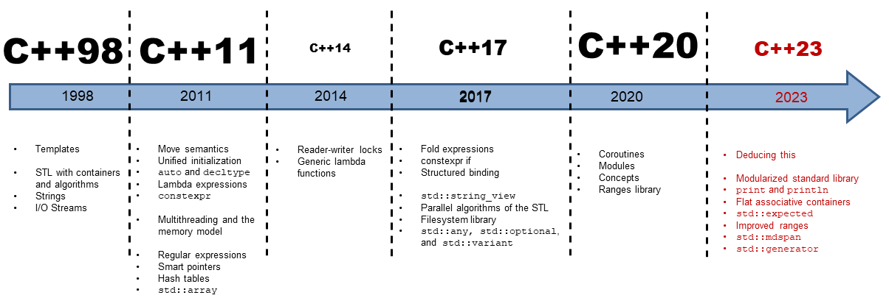

# Moden C++
This repository aim that how to use `Moden C++` and how developers apply effective skills to projects. You can also see example codes and video tutorials.

## What is Modern C++?
The term Moden C++ refers to the use the latest and uppdate techniques with C++. These updates started to add with C++11.

After Modern C++, developers started to learn these 3 important things;
* Algorithms
* Containers
* Iterators

We can make a list Modern C++ versions like that

| Version | Standard | Description |
| :------ | :------- | :---------- |
| [C++98](cpp98/README.md) | ISO/IEC 14882:1998 | It is the first official C++ standard. This version defines the core features of the C++ language and laid the foundation for the modern C++ language. |
| [C++03](cpp03/README.md) | ISO/IEC 14882:2003 | It is a revision of C++98 with bug fixes and fixes. It is basically a revised version of C++98. |
| [C++11](cpp11/README.md) | ISO/IEC 14882:2011 | It is a major release that brings major language expansion and modernization. Many important features such as smart pointers, lambda expressions, range-based for loop have come with this version. |
| [C++14](cpp14/README.md) | ISO/IEC 14882:2014 | It is a version containing additions and corrections to C++11. While this version continues the evolution of the language, it does not contain major changes. |
| [C++17](cpp17/README.md) | ISO/IEC 14882:2017 | It is a version that further improves the C++ language. Parallel algorithms include features such as updated std::optional and std::variant, if-constexpr. |
| [C++20](cpp20/README.md) | ISO/IEC 14882:2020 | Adds important features such as Ranges, Concepts, Coroutines. C++20 brings significant improvements to many aspects of the language and library. |
| [C++23](cpp23/README.md) | | |
| C++26 | | Loading.... |
